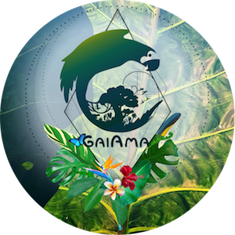

  

<h1 align="center"><a href="https://www.gaiama.org" title="GaiAma.org">GaiAma.org</a> 
<small>Making rainforests cool again</small>
</h1>

  
  <!--  -->
  
  
  <!-- 
   -->
  <!--  -->
  
  
  

    
<!--  -->

## Features

- [Netlify](https://www.netlify.com/): front-end hosting
- [DigitalOcean](https://m.do.co/c/bcef7e4dac88): back-end hosting
- [GatsbyJS](https://www.gatsbyjs.org/)
- [Emotion](https://emotion.sh/) for styling
- [Node.js 10.10](https://nodejs.org/en/)
- [MDX](https://github.com/ChristopherBiscardi/gatsby-mdx)
- [Changelog](CHANGELOG.md)
- [I18n: Auto discover & link translations](gatsby/createPages.js#L47-L80)
- [Pager: older / newer article](gatsby/createResolvers.js#L21-L40)
- [related articles](gatsby/createResolvers.js#L9-L20) auto suggested
- [react-toastify](https://github.com/fkhadra/react-toastify)
- [babel-plugin-preval](https://github.com/kentcdodds/babel-plugin-preval): pre-evaluate color conversions in [theme.js](src/theme.js)
- [Offline support](https://github.com/gatsbyjs/gatsby/tree/master/packages/gatsby-plugin-offline#readme)
- [gatsby-image](https://github.com/gatsbyjs/gatsby/tree/master/packages/gatsby-image#readme) and [gatsby-remark-images](https://github.com/gatsbyjs/gatsby/tree/master/packages/gatsby-remark-images#readme) for responsive images
- [SEO (OpenGraph Tags, Twitter Tags)](src/components/MainLayout/index.js#L195)
- [gatsby-source-instagram](https://github.com/oorestisime/gatsby-source-instagram)
- [conventional-changelog-cli](https://github.com/conventional-changelog/conventional-changelog)
- [commit message template](.github/commit_template)
- [Yarn](https://yarnpkg.com)
- [All Contributors by Kent C. Dodds](https://github.com/kentcdodds/all-contributors)

## Roadmap

- integrate programming blog, which should reuse as much as possible
- change [react-helmet](https://github.com/nfl/react-helmet) to [react-head](https://github.com/tizmagik/react-head)
- code improvements

## Development

We use `yarn` as Node.js package manager instead of `npm` and a semantic commit convention based on [Angular's](https://github.com/angular/angular.js/blob/master/DEVELOPERS.md#-git-commit-guidelines).
This way we can auto generate our [changelog](CHANGELOG.md) using [conventional-changelog-cli](https://github.com/conventional-changelog/conventional-changelog).
If you want, you can use the `yarn setup:git` script to link our [commit message template](.github/commit_template) in your local git settings (only for this repository), which can serve as a cheat sheet and reminder.
To build the changelog you can run `yarn changelog`

## Contributors

Thanks goes to these wonderful people ([emoji key](https://github.com/kentcdodds/all-contributors#emoji-key)):

<!-- ALL-CONTRIBUTORS-LIST:START - Do not remove or modify this section -->
<!-- prettier-ignore -->
| [ <b>Can Rau</b>](https://github.com/CanRau) [💻](https://github.com/GaiAma/gaiama.org/commits?author=CanRau "Code") [🎨](#design-CanRau "Design") [📖](https://github.com/GaiAma/gaiama.org/commits?author=CanRau "Documentation") [🔍](#fundingFinding-CanRau "Funding Finding") [🤔](#ideas-CanRau "Ideas, Planning, & Feedback") [🚇](#infra-CanRau "Infrastructure (Hosting, Build-Tools, etc)") | [ <b>Stefan Ladwig</b>](https://github.com/sladwig) [📖](https://github.com/GaiAma/gaiama.org/commits?author=sladwig "Documentation") | [ <b>Kemane Ba</b>](https://github.com/kemane) [🎨](#design-kemane "Design") |
| :---: | :---: | :---: |

<!-- ALL-CONTRIBUTORS-LIST:END -->

This project follows the [all-contributors](https://github.com/kentcdodds/all-contributors) specification. Contributions of any kind welcome!
